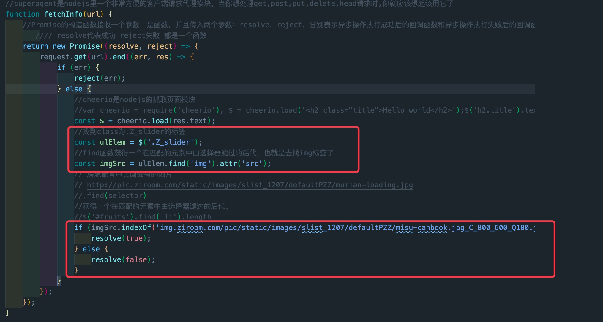
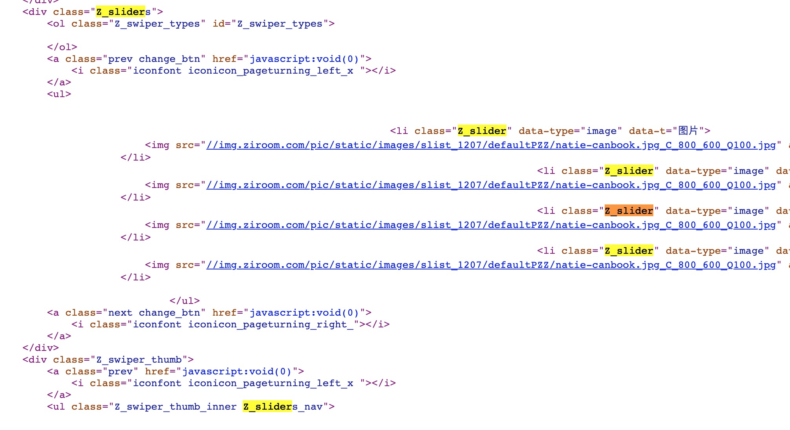
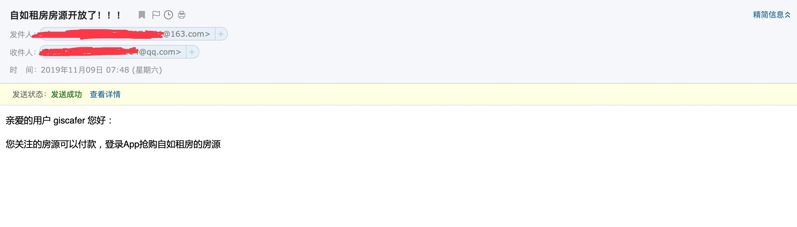

# ziroom-rentingRoom
自如租房，房源状态监听，实时邮件发送，可以自行设置时间进行通知次数的限定，原理就是去检测其房屋图片状况，例如如果图片未换成实际房间内的图片，还是可配置图片状态那么说明此房间还没有配置完成，此处复用https://github.com/giscafer/ziroom-crawler
基于此demo进行了修改，修改地方在于匹配的内容，匹配到相应的img标签的父标签发生了更改以及图片的url部分，后续保持更新，当然各位小伙伴们也可自行在crawler.js当中修改，修改地方会在crawler.js当中指出
## Usage

**我们需要修改的地方**

### index.js

下面的CRAWER_URL修改为自己要抢房的url，下面的url当中设置为自己要通知的email
```js

const CRAWER_URL = 'http://www.ziroom.com/x/xxxxx.html'; 
mail.sendAlertMail('xxxx@qq.com');  

```

想要修改几分钟执行一次可以在下面的代码中进行修改
```js

let job2 = new CronJob('*/2 * * * * *', function () {
    crawlering();
}, null, true, 'Asia/Shanghai');

```

### mail.js

```js

// 写要配置的发送方的邮箱
const mail_opts = {
    host: 'smtp.163.com',
    port: 25,
    auth: {
        user: 'xxxx@163.com', // 邮箱账号
        pass: '******' // 密码
    }
};

```
### crawler.js
此处用于今后自如进行更新，可能html源码结构会发生变化，自助修改的地方



### 运行
- `npm install`
- `node index`


### 截图


<br>

